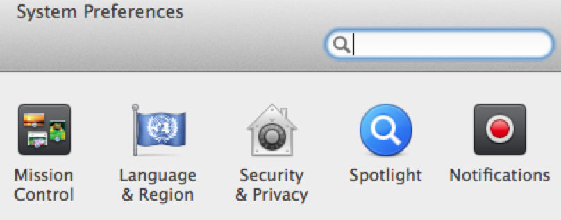
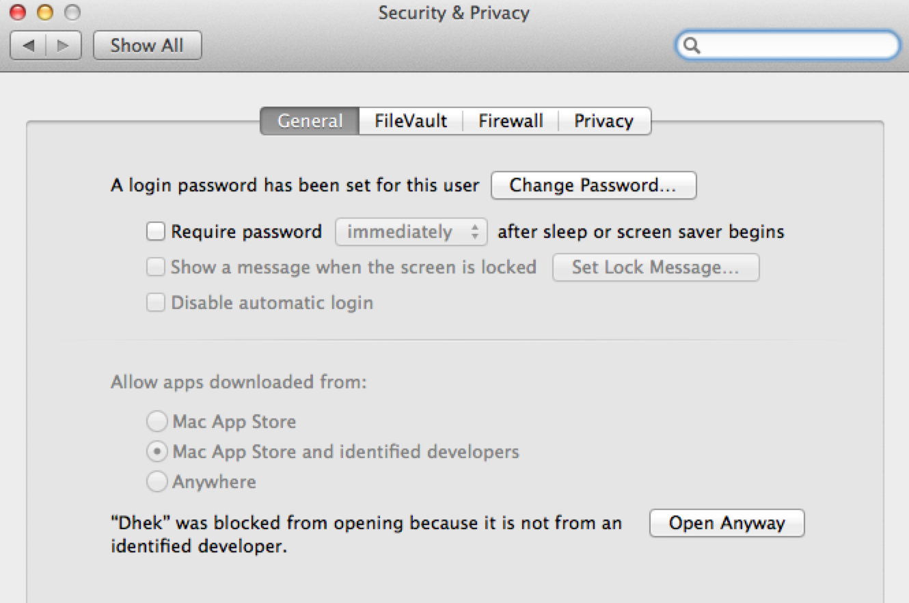
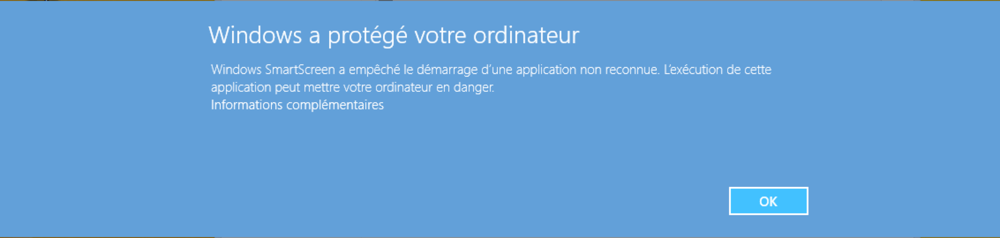
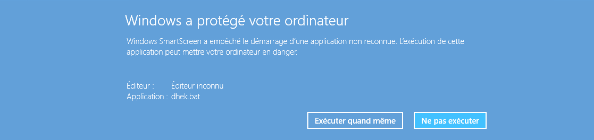

# Dhek

PDF templating application (or on the Discworld, supreme Djelibeybian god).

## Motivation

Starting from any PDF, Dhek allows to define areas you want to fill with data later (templating).

Unlike other solution, it doesn't require PDF to have been made using Acrofields, or any PDF extension/constraint. Moreover, you don't need to alter PDF in any way to be able to create a template. *It can be done above any existing PDF*.

[Template format](#template-format) is an open one (JSON), so that you can use it whatever is your programming/integration environment (PHP, JVM, .Net, ...).

You can also use a [service](http://go.applidok.com) allowing Web visitor to fill data for your templates using form, and finally get their custom/filled PDF.

## Get started

Binary distributions for Windows (7+) and Mac OS X (10.8/10.9) can be found in [releases section](https://github.com/applicius/dhek/releases).

### Mac OS X

First time launching a Dhek release, system will warn you about 'unidentifed developer'.


In this case, you open the System Preferences to ajust Security & Privacy.



In Security & Privacy preferences, you will have the chance to indicate that you do know Dhek origin, and want to 'Open Anyway'.



> This is necessary only at first launch of a Dhek release. Then OS X won't display is warning anymore.

### Windows 7

On Windows 7, for security purposes system will warn you first time you execute application.


Being sure that involved application is Dhek you wanted to start, you can click on Execute button.

### Windows 8

First time you click on a download Dhek release in Windows 8, system will warn you that the system has been protected, and application start prevented.



This is a security warning in case some malicious application try to execute pas operations, but is not appropriate in case you know the application to be started and do want to open it.

At the bottom of this warning, there is a link to display information to be sure which application has been stopped by the system.



At this step, being sure application prevented to launch is Dhek release you wanted to start, you can click on button in warning details to Execute Anyway.

> After you have first executed Dhek, the system won't display the warning anymore, and application will start normally.

## Build

You can also build Dhek by yourself with following information.

### Setup environment

Make sure gtk, pango, cairo and poppler are installed on your machine.

#### Mac OS X

Build on Mac OS X has following requirements.

- [GTK2 with Quartz](http://applicius-en.tumblr.com/post/91636015743/gtk2-with-osx-quartz).
- [GTK2 Murrine theme engine](git://git.gnome.org/murrine); Optional but recommanded to make it look nice (see [Mac OS X patch](https://bugzilla.gnome.org/show_bug.cgi?id=733124) to build it).

#### Haskell Platform

```
cabal update
cabal install alex happy gtk2hs-buildtools
```

#### Dhek

In order to build Dhek itself (finally):

```
cabal install --only-dependencies
cabal configure
cabal build
```

> In case of linking error about `_iconv`, re-run `cabal configure` with `--extra-lib-dir=/usr/lib` to enforce system version of libiconv is used.

You can install an executable by doing:

```
cabal install
```

At this point, Dhek can be launched with `./dist/build/dhek/dhek`

### Windows 7/8

TODO

## Integration

Dhek template can be integrated with any platform supporting PDF and JSON. Indeed, template format is the JSON one.

### Template format

```json
{
  "pages": [
    { /* mappings for first page, index 0 */
      "areas": [
        { /* first area of first page */
          "type": "text"/* or "checkbox"*/
          "height": 10.23/* pt */,
          "width": 23.456,
          "x": 0.1234/* pt */,
          "y": 2.45,
          "name": "Field name"
        },
        { /* second area of first page */
          "type": "radio",
          "height": 10.23/* pt */,
          "width": 23.456,
          "x": 12.34/* pt */,
          "y": 24.5,
          "name": "Radio name"/* same for all radio in same group */,
          "value": "distinctInRadioGroup"
        },
        { /* third area of first page */
          "type": "celltext",
          "name": "Text cells"/* same for all cells in same text */,
          "cells": [
            { /* one cell = one text character */
              "index": 0 /* first character at index 0 */,
              "height": 10.23/* pt */,
              "width": 23.456,
              "x": 123.4/* pt */,
              "y": 245
            }
            /* , { ... } */
          ]
        }
        /* , { ... }, ... */
      ]
    },
    null /* no mapping for second page, index 1 */
    /* , { third page, index 2 ... } */
  ]
}
```

Dhek is using UTF-8 character set, so so there is not issue to use space, ponctuation signs or accentuated character while preparing template (e.g. in area name).

### PHP integration

Dhek mappings can be used in PHP using [FPDF](http://www.fpdf.org/) library.

```php
<?php
$json = json_decode(file_get_contents("test.json"));

require("fpdf/fpdf/fpdf.php");
require("fpdf/fpdi/fpdi.php");

$pdfSrcPath = "test.pdf";

$pdf = new FPDI("P", //L=>Landscape / P=>Portrait
  "pt" /* point */ );

$fontSize = 14;

$pagecount = $pdf->setSourceFile($pdfSrcPath);
$testText  = "abcdefghijklmnopqrstuvwxyz0123456789";

for ($i = 0; $i < $pagecount; $i++) {
  $pdf->AddPage();
  $tplIdx = $pdf->importPage($i + 1);
  $pdf->useTemplate($tplIdx, 0, 0, 0, 0, true);
  
  if (isset($json->pages[$i]) && isset($json->pages[$i]->areas)) {
    for ($j = 0; $j < count($json->pages[$i]->areas); $j++) {
      $area = $json->pages[$i]->areas[$j];
      $x    = $area->x;
      $y    = $area->y;
      $w    = $area->width;
      $h    = $area->height;
      
      // Draw blue rect at bounds
      $pdf->SetDrawColor(0, 0, 255);
      $pdf->SetLineWidth(0.2835);
      $pdf->Rect($x, $y, $w, $h);
      
      if ($area->type == "checkbox") {
        $pdf->SetDrawColor(0, 255, 0);
        $pdf->SetLineWidth(2.0);
        $pdf->Line($x, $y, $x + $w, $y + $h);
        $pdf->Line($x, $y + $h, $x + $w, $y);
      } else if ($area->type == "text") {
        // 'Free' text
        $pdf->SetLineWidth(1.0); // border
        
        $iw       = $w - 2 /* 2 x 1 */ ;
        $v        = utf8_decode($area->name);
        $overflow = ($pdf->GetStringWidth($v) > $iw);
        while ($pdf->GetStringWidth($v) > $iw) {
          $v = substr($v, 0, -1);
        }
        if ($overflow) {
          $v = substr($v, 0, -1) . "\\";
        }
        
        $pdf->SetXY($x, $y);
        $pdf->MultiCell($w, intval($h), $v, true);
      }
    }
  }
}

$pdf->Output("test-dhek.pdf", "F");
?>
```